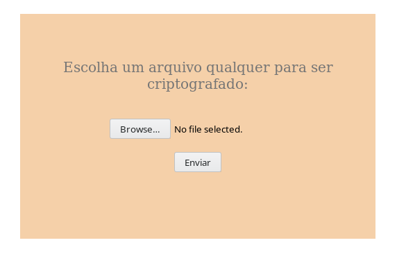
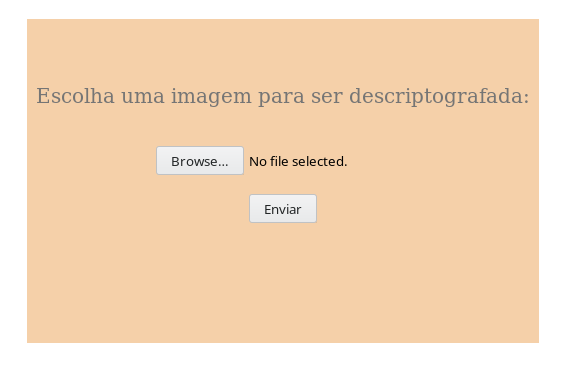
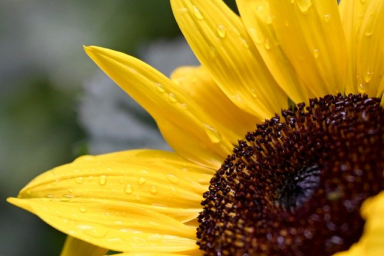

# filePortrait
Converte qualquer arquivo para uma imagem PNG. Permite decodificar a imagem PNG gerada e obter o arquivo inicial.
## Instalação
Para instalar basta copiar os arquivos para o servidor PHP. Lembrando que este precisa ter disponível a lib GD.
## Como usar
Acesse ***encoder.php*** para codificar qualquer arquivo com uma imagem PNG.

Acesse ***decoder.php*** para decodificar o arquivo gerado no passo anterior e obter o arquivo original.

## Resultado
Como arquivo original usei a imagem JPG abaixo, mas poderia ser um arquivo de qualquer tipo: um EXE por exemplo.

O resultado obtido ao codificar a imagem acima seria isto:

## Funcionamento
Como sabemos um arquivo é basicamente um amontoado de bytes. Um byte pode assumir 256 valores distintos. Uma imagem é basicamente um amontoado de pixels. Um pixel representa 1 ponto da imagem e possui uma cor. No padrão RGB uma cor é formada por uma mistura de três cores 'primárias' (Red, Green e Blue) em determinadas intensidades. Cada uma dessas três cores podem assumir 256 valores distintos, já que elas ocupam 1 byte.
Agora que vem a lógica principal do sistema: ao receber um arquivo para criptografar basta dividí-lo em pedaços de 3 bytes. Cada um desses pedaços formarão um pixel da imagem. Desta forma teremos um amontoado de pixels. Agora basta usar a biblioteca GD do PHP para organizar estes pixels numa imagem da melhor forma.
